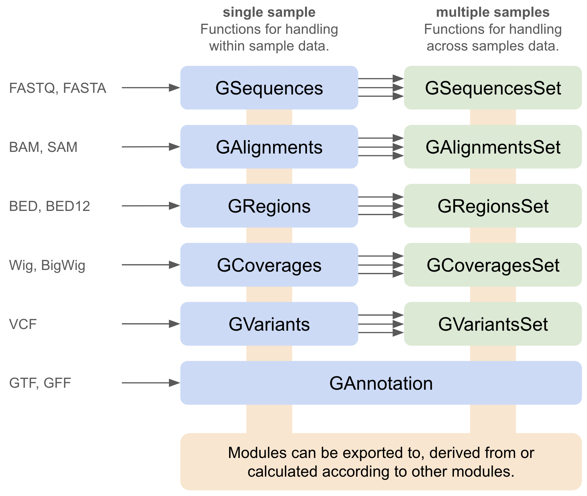

Welcome to Genomkit's documentation!
===================================

.. note::

   This project is under active development.

Genomkit is designed as a collection of modules and functions to handle various file types in bioinformatic analyses. Each file type in fact represents an aspect of the real biological networks. Just as a diamond has many facets, the real biological system has also many views according to the measurement methods.

Although many sophisticated tools or pipelines have been developed for each file type, there isn't a well-known tool for integrating all of them and providing a convenient way to explore all the file types. Genomkit offers the basic building blocks for further exploring the data or developing any new tools. Below is the scheme of all the modules in Genomkit:

In addition, we aim to make all the operations in Genomkit efficient in memory usage and fast in speed with optimized codes and parallel computing out of the box.

Contents
--------

.. toctree::
   concept
   usage
   examples
   genomic_sequences
   genomic_reads
   genomic_regions

